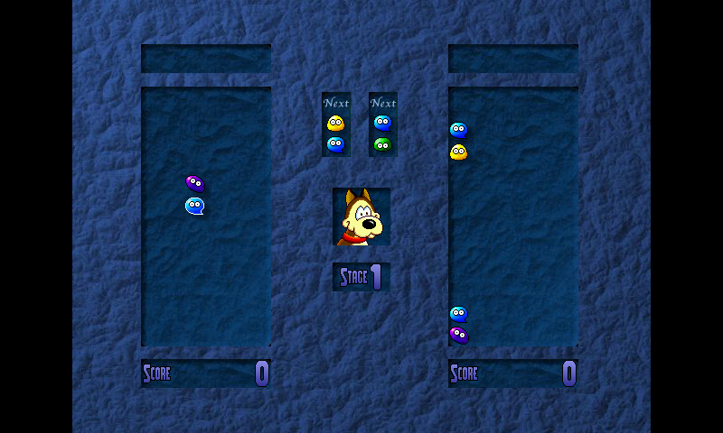

# CandyCrisis

Unofficial Linux and Pandora port for the OpenSource game Candy Crisis

Go to the official Website http://candycrisis.sourceforge.net/ for more informations.

# Build

You will need CMake, SDL2, SDL2_image and either fmod or SDL2_Sound to build CandyCrisis

simply
`cmake && make`
to build the SDL_sound version
or 
`cmake -DUSE_FMOD=ON && make`
for the FMOD version.

You can found an SDL2 compatible verison of SDL_sound here: https://github.com/ptitSeb/SDL_sound

Windows and MacOS build are not officially supported in this repo, but should works (Just missings the libs for Windows, and project file for MacOS).

# Notes

The FMod version has been modified to use an old FMOD 3.x lib.

The SDL_Sound need and SDL_Sound compile for SDL2. You can found one here: https://github.com/ptitSeb/SDL_sound (the lib is then called libSDL2_sound.so to be able to have both SDL1.2 and SDL2 version on the system).

Also, note that when the music accelerate (when one of the player is close to the end), the FMOD version simply change the Tempo of the music, where the SDL_sound version change the frequency of the music. So both version will sound differently. Music is still accelerated, so that's fine, but it's actualy a limitation of SDL_sound, and I didn't found a workaround to change tempo of the MOD files.
